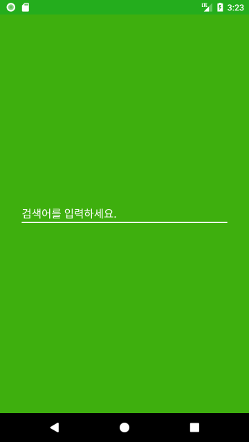

# NAVER 블로그 검색 App

## 요구사항
* [1. 검색어 입력창 제공](#1-검색어-입력창-제공)
* [2. 검색 결과 목록 화면 제공](ㅇ#2-검색-결과-목록-화면-제공)
* [3. 특정 item 선택시 blog link 페이지 이동](#3-특정-item-선택시-blog-link-페이지-이동)
* [4. 검색 결과 pagination](#4-검색-결과-pagiantion)


## 1. 검색어 입력창 제공

 

검색어 입력창은 [IntroActivity](https://github.com/cwpark/NaverBlogSearch/blob/master/app/src/main/java/com/apollo/andorid/apollosearch/view/intro/IntroActivity.java), [SearchActivity](https://github.com/cwpark/NaverBlogSearch/blob/master/app/src/main/java/com/apollo/andorid/apollosearch/view/search/SearchActivity.java) 2가지 화면에서 제공합니다.


[IntroActivity]()는 앱 런치 화면이며, 초기 검색 시에만 보여집니다. 실제 검색 결과는 SearchActivity로 검색 키워드를 전달해 검색합니다.

[관련 코드:](https://github.com/cwpark/NaverBlogSearch/blob/master/app/src/main/java/com/apollo/andorid/apollosearch/view/intro/IntroViewModel.java#L51)
``` java
public void search() {
    if (TextUtils.isEmpty(keyword)) {
        errorMessageSubject.onNext(R.string.input_keyword);
    } else {
        navigator.openSearch(keyword);
    }
}
```

[SearchActivity](https://github.com/cwpark/NaverBlogSearch/blob/master/app/src/main/java/com/apollo/andorid/apollosearch/view/search/SearchActivity.java)에선 연속해서 검색이 가능하며, 정렬 옵션도 이 화면에서 선택 가능합니다.


## 2. 검색 결과 목록 화면 제공


[SearchActivity](https://github.com/cwpark/NaverBlogSearch/blob/master/app/src/main/java/com/apollo/andorid/apollosearch/view/search/SearchActivity.java)에서 검색 결과 목록 화면을 제공합니다.

뷰의 상태 변화는 [SearchViewModel](https://github.com/cwpark/NaverBlogSearch/blob/master/app/src/main/java/com/apollo/andorid/apollosearch/view/search/SearchViewModel.java)의 Observable 데이터를 [SearchFragment](https://github.com/cwpark/NaverBlogSearch/blob/master/app/src/main/java/com/apollo/andorid/apollosearch/view/search/SearchFragment.java)에서 바인딩하여 변화가 있을 때마다 업데이트합니다.

검색 결과는 [BlogApi](https://github.com/cwpark/NaverBlogSearch/blob/master/app/src/main/java/com/apollo/andorid/apollosearch/data/source/remote/api/BlogApi.java) -> [BlogRemoteSource](https://github.com/cwpark/NaverBlogSearch/blob/master/app/src/main/java/com/apollo/andorid/apollosearch/data/source/remote/BlogRemoteSource.java) -> [BlogRepository](https://github.com/cwpark/NaverBlogSearch/blob/master/app/src/main/java/com/apollo/andorid/apollosearch/data/source/BlogRepository.java) -> [SearchViewModel](https://github.com/cwpark/NaverBlogSearch/blob/master/app/src/main/java/com/apollo/andorid/apollosearch/view/search/SearchViewModel.java) -> [SearchFragment](https://github.com/cwpark/NaverBlogSearch/blob/master/app/src/main/java/com/apollo/andorid/apollosearch/view/search/SearchFragment.java) 순으로 처리됩니다.

[SearchViewModel](https://github.com/cwpark/NaverBlogSearch/blob/master/app/src/main/java/com/apollo/andorid/apollosearch/view/search/SearchViewModel.java)에서 기타 View 상태에 관련된 데이터와 묶인 [SearchUiModel](https://github.com/cwpark/NaverBlogSearch/blob/master/app/src/main/java/com/apollo/andorid/apollosearch/view/search/SearchUiModel.java), [LoadMoreUiModel](https://github.com/cwpark/NaverBlogSearch/blob/master/app/src/main/java/com/apollo/andorid/apollosearch/view/search/LoadMoreUiModel.java)로 매핑되어 뷰를 업데이트합니다.

[관련 코드:](https://github.com/cwpark/NaverBlogSearch/blob/master/app/src/main/java/com/apollo/andorid/apollosearch/view/search/SearchFragment.java#L85)
``` java
bind(viewModel.getSearchUiModel()
    .subscribeOn(Schedulers.io())
    .observeOn(AndroidSchedulers.mainThread())
    .subscribe(this::updateUi, this::handleError));

bind(viewModel.getLoadMoreUiModel()
    .subscribeOn(Schedulers.io())
    .observeOn(AndroidSchedulers.mainThread())
    .subscribe(this::updateUi, this::handleError));

...

private void updateUi(SearchUiModel model) {
    int blogsVisible = model.isBlogsVisible() ? View.VISIBLE : View.GONE;
    blogsView.setVisibility(blogsVisible);

    int emptyViewVisible = model.isEmptyResultVisible() ? View.VISIBLE : View.GONE;
    emptyView.setVisibility(emptyViewVisible);

    if (model.isBlogsVisible()) {
        blogAdapter.setBlogs(model.getBlogs());
    }
}

private void updateUi(LoadMoreUiModel model) {
    blogAdapter.addBlogs(model.getBlogs());
    endlessScrollListener.setCanLoadMore(model.isCanLoadMore());
}

```


## 3. 특정 item 선택시 blog link 페이지 이동


블로그 데이터를 표현하는 [BlogAdapter](https://github.com/cwpark/NaverBlogSearch/blob/master/app/src/main/java/com/apollo/andorid/apollosearch/view/search/adapter/BlogAdapter.java)는 아이템 클릭에 대한 이벤트를 [BlogItem](https://github.com/cwpark/NaverBlogSearch/blob/master/app/src/main/java/com/apollo/andorid/apollosearch/view/search/adapter/BlogItem.java)으로부터 가져와 처리합니다.

[BlogItem](https://github.com/cwpark/NaverBlogSearch/blob/master/app/src/main/java/com/apollo/andorid/apollosearch/view/search/adapter/BlogItem.java)은 [SearchViewModel](https://github.com/cwpark/NaverBlogSearch/blob/master/app/src/main/java/com/apollo/andorid/apollosearch/view/search/SearchViewModel.java#L159)에서 생성됩니다.

[관련 코드:](https://github.com/cwpark/NaverBlogSearch/blob/master/app/src/main/java/com/apollo/andorid/apollosearch/view/search/SearchViewModel.java#L159)
``` java
private BlogItem createBlogItem(Blog blog) {
    return new BlogItem(blog,
            () -> navigator.openBlogPost(blog),
            () -> navigator.openBlog(blog));
}
```


클릭 이벤트 발생 시, [WebViewActivity](https://github.com/cwpark/NaverBlogSearch/blob/master/app/src/main/java/com/apollo/andorid/apollosearch/view/webview/WebViewActivity.java)를 실행하며 [Blog](https://github.com/cwpark/NaverBlogSearch/blob/master/app/src/main/java/com/apollo/andorid/apollosearch/data/Blog.java)의 link를 전달합니다.

[관련 코드:](https://github.com/cwpark/NaverBlogSearch/blob/master/app/src/main/java/com/apollo/andorid/apollosearch/view/search/SearchNavigator.java#L24)
``` java
public void openBlogPost(@NonNull Blog blog) {
    Intent intent = navigator.intentFor(WebViewActivity.class);
    intent.putExtra(WebViewActivity.EXTRA_URL, blog.getLink());
    navigator.start(intent);
}
```

웹페이지 내 자바스크립트 처리를 위해 WebChromeClient의 onJsAlert과 onJsConfirm 메소드를 오버라이딩 해 [JsAlertDialog](https://github.com/cwpark/NaverBlogSearch/blob/master/app/src/main/java/com/apollo/andorid/apollosearch/view/webview/JsAlertDialog.java)를 띄우도록 했습니다.

[관련 코드:](https://github.com/cwpark/NaverBlogSearch/blob/master/app/src/main/java/com/apollo/andorid/apollosearch/view/webview/WebViewFragment.java#L47)
``` java
webView.setWebChromeClient(new WebChromeClient() {
            @Override
            public boolean onJsAlert(WebView view, String url, String message, JsResult result) {
                JsAlertDialog.newInstance(message, false)
                        .setOnConfirmAction(result::confirm)
                        .show(getFragmentManager(), TAG_ALERT);
                return true;
            }

            @Override
            public boolean onJsConfirm(WebView view, String url, String message, JsResult result) {
                JsAlertDialog.newInstance(message, true)
                        .setOnConfirmAction(result::confirm)
                        .setOnCancelmAction(result::cancel)
                        .show(getFragmentManager(), TAG_CONFIRM);
                return true;
            }
        });
```

## 4. 검색 결과 Pagiantion


pagination 처리를 위해 [BlogRepository](https://github.com/cwpark/NaverBlogSearch/blob/master/app/src/main/java/com/apollo/andorid/apollosearch/data/source/BlogRepository.java)에서 start, display 대신 page를 관리하도록 했습니다.

[관련 코드:](https://github.com/cwpark/NaverBlogSearch/blob/master/app/src/main/java/com/apollo/andorid/apollosearch/data/source/BlogRepository.java#L71)
``` java
public Maybe<SearchResult<Blog>> search(String keyword, Sort sort) {
    searchOption = new SearchOption(keyword, searchPageSize, sort);
    return blogRemoteSource.search(searchOption.getKeyword(), searchOption.getDisplay(),
            searchOption.getStart(), searchOption.getSort())
            .doOnSubscribe(__ -> searching = true)
            .doOnError(__ -> searching = false)
            .doOnSuccess(__ -> {
                searching = false;
                searchOption.nextPage();
            });
}

public Maybe<SearchResult<Blog>> loadMore() {
    if (searching || searchOption == null) {
        return Maybe.empty();
    }

    return blogRemoteSource.search(searchOption.getKeyword(), searchOption.getDisplay(),
            searchOption.getStart(), searchOption.getSort())
            .doOnSuccess(__ -> searchOption.nextPage());
}

...


// SearchOption#nextPage
public void nextPage() {
    page++;
    start = ((page - 1) * display) + 1;
}
```

다만, 이 방법으로 API를 이용했을 때 정확하게 맞지 않는 부분이 있는 것을 확인했습니다.
예를들어 검색 결과의 total 값이 21인 키워드에 대해 display=1, start=21로 지정했을 경우 total, display 값이 이전과 달라지는 경우가 있었습니다.
이 부분은 블로그 검색 API 내부 로직에 대해 정확하게 알지 못해 더 구체적인 해결 방법을 마련하지 못했습니다.

View단에선 RecyclerView의 ScrollListener를 Pagination 용으로 제작해 사용했습니다.([EndlessScrollListener](https://github.com/cwpark/NaverBlogSearch/blob/master/app/src/main/java/com/apollo/andorid/apollosearch/view/base/EndlessScrollListener.java))
